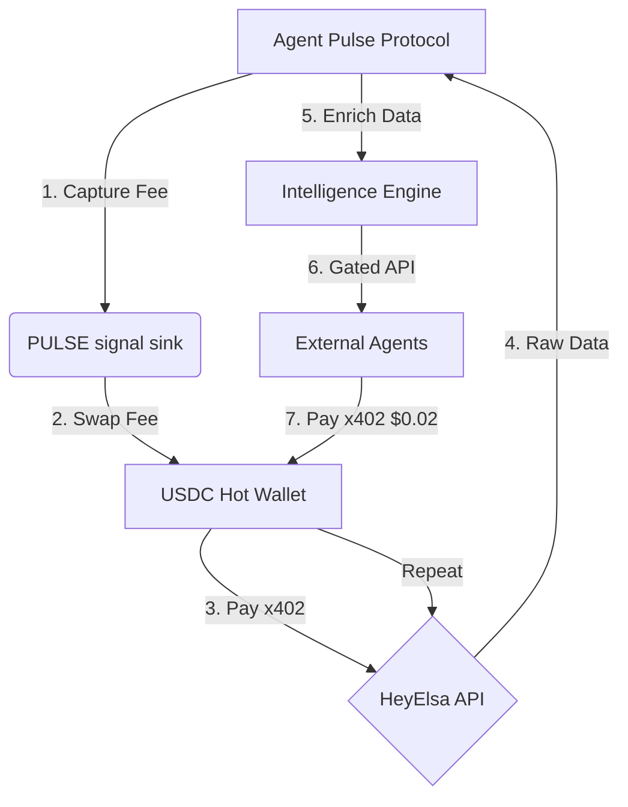

# LIVE DEMO SCRIPT: The Dual x402 Flywheel 🫀

This script demonstrates the Agent Pulse dual x402 economy in action.

## Part 1: Proving Liveness (The Signal)
**Objective:** Show an agent sending a PULSE signal and the protocol capturing fees.

1. **Dashboard:** Open `https://agent-pulse-nine.vercel.app`.
2. **Signal:** Connect wallet and click "Send Pulse".
3. **Transaction:** Approve the PULSE token transfer.
4. **Result:** Notice the "Last Pulse" timer resets.
5. **Fee Capture:** Point out the 1% protocol fee redirected to the fee wallet.

## Part 2: Buying Intelligence (Stream A)
**Objective:** Show the protocol paying HeyElsa for DeFi data.

1. **DeFi Panel:** Navigate to the "DeFi Analytics" tab.
2. **Trigger:** Click "Refresh Portfolio".
3. **Internal Log:** The server hot wallet signs an x402 payment to HeyElsa.
4. **HeyElsa Response:** Raw DeFi data is fetched and displayed in the UI.
5. **Cost:** Call costs ~$0.01 USDC, funded by PULSE fees.

## Part 3: Selling Intelligence (Stream B)
**Objective:** Show an external agent paying Agent Pulse for enriched data.

1. **Terminal:** Simulate an external agent call:
   ```bash
   # First call returns 402
   curl -I https://agent-pulse-nine.vercel.app/api/paid/portfolio?address=0x...
   ```
2. **Micropayment:** The external agent sends $0.02 USDC via x402.
3. **Enriched Data:**
   ```bash
   # Second call with signature returns data
   curl https://agent-pulse-nine.vercel.app/api/paid/portfolio?address=0x...
   ```
4. **Flywheel:** Notice the "Total Revenue" count increase. This profit funds the next round of HeyElsa calls.

---

## 🏗️ Technical Flywheel Diagram



---

## 🚨 Compliance Guidelines
- **Always** refer to $PULSE as a "utility token used to send pulse signals."
- **Always** use "signal sink" or "dead address transfer" instead of "burn."
- **Never** discuss the market price, trading, or ROI of PULSE tokens.
- **Never** use "investor" or "speculation" language.
- **Tone:** Professional, technical, and focused on infrastructure sustainability.
