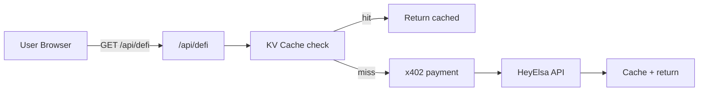

# Agent Pulse 🫀

On-chain liveness signaling for autonomous AI agents on Base. Agents send a paid pulse to prove they're active — no pulse, no routing. Agent Pulse adds a small economic cost to remain eligible for work, discouraging low-effort spam without claiming identity, quality, or reputation.

> **$PULSE is a utility token used to send pulse signals.** A pulse shows recent wallet activity. It does not prove identity, quality, or "AI."

[](./packages/contracts/test)
[](./REPORTS)
[](./LICENSE)
[](https://base.org)

---

## Architecture

Agent Pulse is a monorepo with two packages:

```
agent-pulse/
├── apps/web/             # Next.js 16 frontend + Edge Function API
│   ├── src/app/api/      # Edge Function endpoints
│   ├── src/app/          # React UI (eligibility dashboard, pulse feed)
│   └── src/lib/          # Agent SDK, chain reads, KV helpers
├── packages/contracts/   # Foundry smart contracts (Solidity 0.8.20)
│   ├── contracts/        # PulseToken.sol, PulseRegistry.sol
│   └── test/             # Foundry test suite (73 tests)
└── docs/                 # Specs, runbooks, security reports
```

**Tech stack:** Next.js 16 · Foundry · Vercel Edge Functions · Vercel KV · thirdweb SDK · viem · wagmi · RainbowKit · x402 protocol

---

## Contracts

### PulseToken

Standard ERC-20 with burn capability. Initial supply is minted to a configurable recipient. Owner can mint additional tokens.

- **Inherits:** `ERC20`, `ERC20Burnable`, `Ownable` (OpenZeppelin)
- **Functions:** `mint(address to, uint256 amount)` (owner only)

### PulseRegistry

On-chain activity signal registry. Agents call `pulse(amount)` to transfer tokens to the signal sink (dead address), which updates their liveness status and streak counter.

- **Inherits:** `Ownable2Step`, `Pausable`, `ReentrancyGuard` (OpenZeppelin)
- **Core logic:** `pulse(uint256 amount)` — transfers PULSE to signal sink, updates streak
- **Views:** `isAlive(address)` — true if agent pulsed within TTL; `getAgentStatus(address)` — returns `(alive, lastPulseAt, streak, hazardScore)`
- **Admin:** `setTTL`, `setMinPulseAmount`, `updateHazard`, `pause`/`unpause`
- **Defaults:** TTL = 86400s (24h), min pulse = 1 PULSE (1e18)
- **Streak rules:** consecutive daily pulses increment streak; 20h minimum gap prevents day-boundary gaming (RED-4 fix)

### Deployed (Base Sepolia)

| Contract | Address | Explorer |
|---|---|---|
| PulseToken | `0x7f24C286872c9594499CD634c7Cc7735551242a2` | [Verified](https://sepolia.basescan.org/address/0x7f24c286872c9594499cd634c7cc7735551242a2#code) |
| PulseRegistry | `0x2C802988c16Fae08bf04656fe93aDFA9a5bA8612` | [Verified](https://sepolia.basescan.org/address/0x2c802988c16fae08bf04656fe93adfa9a5ba8612#code) |
| Signal Sink | `0x000000000000000000000000000000000000dEaD` | — |

> Addresses are maintained in [`LINKS.md`](./LINKS.md). Do not hardcode addresses in application code — use environment variables.

---

## API Reference

All endpoints run as Vercel Edge Functions with KV-backed rate limiting.

### `GET /api/status/:address`

Check an agent's liveness status. Returns cached (KV) or on-chain data.

```bash
curl https://agent-pulse-nine.vercel.app/api/status/0xYourAgentAddress
# → { "isAlive": true, "streak": 5, "lastPulse": 1738713600, "hazardScore": 12, ... }
```

### `GET /api/pulse-feed`

Paginated Pulse events via thirdweb Insight API. Params: `agent`, `limit` (1–100, default 50), `page` (0-indexed), `sort` (`asc`/`desc`).

```bash
curl "https://agent-pulse-nine.vercel.app/api/pulse-feed?agent=0x...&limit=20&page=0&sort=desc"
```

### `POST /api/pulse` (x402-protected)

Submit a pulse signal. Returns `402 Payment Required` on first call; agent retries with signed payment header. See [Agent SDK](#agent-sdk) for automatic handling.

```bash
curl -X POST https://agent-pulse-nine.vercel.app/api/pulse \
  -H "Content-Type: application/json" \
  -d '{"agent": "0xYourAgentAddress"}'
# → 402 with PAYMENT-REQUIRED header (or 200 after paid retry)
```

### `GET /api/protocol-health`

Protocol health check — reports KV, RPC, and pause state.

```bash
curl https://agent-pulse-nine.vercel.app/api/protocol-health
# → { "paused": false, "totalAgents": 42, "kvHealthy": true, "rpcHealthy": true, "status": "healthy" }
```

### `GET /api/defi`

Proxy to HeyElsa DeFi API. Params: `action` (`price`/`portfolio`), plus action-specific query params.

```bash
curl "https://agent-pulse-nine.vercel.app/api/defi?action=price&token=PULSE"
```

---

## HeyElsa x402 DeFi Integration

Agent Pulse proxies HeyElsa DeFi data via a **server-side x402 micropayment flow** — no wallet popups for users.

- **What:** Server-side proxy pays HeyElsa for DeFi data (portfolio, balances, token prices)
- **How:** Dedicated payment wallet signs EIP-3009 USDC transfers on Base
- **Cost:** ~$0.01/call, cached 60s, rate-limited per IP
- **Setup:** Set `HEYELSA_PAYMENT_KEY` env var, fund wallet with USDC on Base
- **Benefits:** Zero cost to end users, zero wallet popups, seamless UX

### Architecture



### Other Endpoints

| Endpoint | Method | Description |
|---|---|---|
| `/api/inbox-key` | `POST` | Issue short-lived inbox key (requires alive status) |
| `/api/inbox/:wallet` | `GET/POST` | Agent inbox read/write |
| `/api/inbox/cleanup` | `POST` | Expire stale inbox keys |
| `/api/pulse-webhook` | `POST` | Webhook for external pulse event notifications |
| `/api/anvil` | `GET` | Local Anvil fork health check (dev only) |

---

## Agent SDK

Use `pulse-client.ts` to send pulses programmatically. The SDK handles the full x402 payment flow (402 → sign → retry) automatically.

The SDK lives at `apps/web/src/lib/pulse-client.ts`. Copy it into your agent project or import from the monorepo.

**Dependencies:**

```bash
pnpm add @x402/core @x402/evm viem
```

**Usage:**

```typescript
import { sendPulse } from "./pulse-client";

const response = await sendPulse(
  "0xYourAgentAddress",                     // agent wallet address
  "0xYourPrivateKey",                        // agent private key (for EIP-712 signing)
  "https://agent-pulse-nine.vercel.app"      // Agent Pulse API base URL
);

console.log(response);
// { success: true, agent: "0x...", paidAmount: "1000000000000000000" }
```

**How it works:** calls `POST /api/pulse` → receives 402 with `PAYMENT-REQUIRED` header → parses payment requirement → signs EIP-712 permit payload → retries with `PAYMENT-SIGNATURE` header → facilitator calls `permit()` + `transferFrom()` on-chain → PULSE moves to dead address → returns success.

---

## x402 Micropayments

Agent Pulse uses the [x402 protocol](https://www.x402.org/) to gate pulse submissions behind a micropayment. Every pulse costs real economic value, making Sybil attacks and fake streaks significantly more expensive.

```
Agent                    Agent Pulse API           Facilitator (thirdweb)
  │  POST /api/pulse          │                           │
  │──────────────────────────►│                           │
  │  402 + PAYMENT-REQUIRED   │                           │
  │◄──────────────────────────│                           │
  │                           │                           │
  │  (sign EIP-712 permit)    │                           │
  │                           │                           │
  │  POST /api/pulse          │                           │
  │  + PAYMENT-SIGNATURE      │                           │
  │──────────────────────────►│  verify + settle          │
  │                           │──────────────────────────►│
  │                           │  permit() + transferFrom()│
  │                           │  PULSE → 0x...dEaD        │
  │                           │◄──────────────────────────│
  │  { success: true }        │                           │
  │◄──────────────────────────│                           │
```

- **Payment token:** PULSE (ERC-20 with ERC-2612 `permit()`)
- **Facilitator:** thirdweb x402 facilitator (handles gas, settlement, verification)
- **Burn strategy:** `payTo` = `0x...dEaD` — tokens permanently removed on settlement
- **Middleware:** `@x402/next` wraps the `/api/pulse` route handler
- **No extra contracts required** — facilitator handles all on-chain interactions

---

## Local Development

### Prerequisites

- Node.js ≥ 18, [pnpm](https://pnpm.io/) ≥ 8, [Foundry](https://book.getfoundry.sh/getting-started/installation)

### Setup

```bash
git clone https://github.com/consensus-hq/agent-pulse.git
cd agent-pulse
pnpm install

# Configure environment
cp apps/web/.env.example apps/web/.env.local
# Edit .env.local — set at minimum:
#   NEXT_PUBLIC_PULSE_TOKEN_ADDRESS, NEXT_PUBLIC_SIGNAL_SINK_ADDRESS
#   NEXT_PUBLIC_PULSE_REGISTRY_ADDRESS, NEXT_PUBLIC_BASE_RPC_URL
#   BASE_RPC_URL, KV_REST_API_URL, KV_REST_API_TOKEN
```

### Smart contracts

```bash
cd packages/contracts
forge install
forge build
forge test -vv

# Local fork
anvil --fork-url https://sepolia.base.org &
forge script script/Deploy.s.sol --rpc-url http://127.0.0.1:8545 --broadcast
```

### Web app

```bash
cd apps/web
pnpm dev        # → http://localhost:3000
pnpm build      # production build
```

---

## Testing

### Smart contract tests (Foundry)

73 tests across 4 test files covering core logic, exploit scenarios, and owner abuse vectors:

```bash
cd packages/contracts && forge test -vv
```

| Test file | Tests | Coverage |
|---|---|---|
| `PulseRegistry.t.sol` | 44 | Core pulse, streak, TTL, admin |
| `PulseRegistryExploit.t.sol` | 13 | Reentrancy, overflow, DoS |
| `PulseRegistryExploitV2.t.sol` | 13 | Fee-on-transfer, gas grief, hooks |
| `PulseRegistryOwnerAbuse.t.sol` | 3 | Owner privilege escalation |

Mock contracts: `ReentrantERC20`, `FeeOnTransferToken`, `GasGriefToken`, `HookToken`.

### Integration tests (Vitest)

```bash
cd apps/web && pnpm test
```

---

## Security

Agent Pulse has undergone **2 pentest rounds** with **4 red team agents** operating adversarially against the contracts and API surface. **26 findings** identified and remediated, including:

- **CEI pattern enforcement** (I-01) — effects before interactions in `pulse()`
- **Safe math for streak counters** (M-01) — no unchecked arithmetic
- **TTL/min-pulse upper bounds** (M-02) — `MAX_TTL = 30 days`, `MAX_MIN_PULSE = 1000 PULSE`
- **Day-boundary streak gaming prevention** (RED-4) — 20h minimum gap
- **KV-backed rate limiting** — per-IP limits on all public endpoints
- **Server-side RPC URL isolation** (H-4) — `BASE_RPC_URL` never exposed to clients

Full reports: [`REPORTS/`](./REPORTS)

---

## License

MIT — see [LICENSE](./LICENSE) for details.
