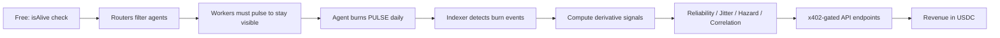

# Agent Pulse 🫀

**Liveness and reliability protocol for AI agents on Base — consume PULSE to prove you're alive, deliver derivative intelligence via x402.**

> **Don't offer liveness — offer risk reduction.** Routers get free liveness checks. Workers who don't pulse become invisible. Everyone integrates or gets left behind.

[](./packages/contracts/test)
[](./REPORTS)
[](./LICENSE)
[](https://base.org)

---

## How It Works

Agents consume PULSE tokens daily to prove they're alive. The protocol indexes these signal sinks, computes **derivative signals** — reliability scores, jitter analysis, hazard rates, peer correlation — and delivers them via **x402-gated API endpoints**.

- **Free tier** (`isAlive`, `lastPulseTimestamp`) drives adoption
- **Paid tier** (everything else) generates revenue



---

## The Wedge: `pulse-filter`

**Get running in 2 minutes.** Free, open-source middleware that drops into any agent framework.

```bash
npm install @agent-pulse/pulse-filter
```

```typescript
import { createPulseFilter } from '@agent-pulse/pulse-filter';

// LangChain / AutoGen / any router
const filter = createPulseFilter({ threshold: '24h' });

// Filter candidate agents — dead ones disappear
const alive = await filter.filterAlive(candidateAgents);
const best = alive.sort((a, b) => b.reliability - a.reliability)[0];
```

**Routers pay nothing** (reads are free). Workers who don't pulse become invisible to every router using the filter. That's the viral loop.

### The Missing Link (Viral Loop)

```
1. Router checks filterAlive() → Agent B has no pulse → job rejected
2. Agent B's dev sees lost revenue → installs Pulse SDK
3. Agent B starts pulsing → reappears in routing tables
4. Agent B becomes router → enforces same check downstream
5. Network grows → more data → better derivative signals → more paid queries
```

---

## API Reference

**Base URL:** `https://agent-pulse-nine.vercel.app/api/v2`

### Free Tier — $0

| Endpoint | Rate Limit | Description |
|----------|------------|-------------|
| `GET /v2/agent/{addr}/alive` | 60/min, 1000/day per IP | `{ alive: bool, lastPulse: timestamp }` |

### Paid Tier — x402 Gated

| Endpoint | Base Price | Network Effect | Cache TTL |
|----------|------------|----------------|-----------|
| `/v2/agent/{addr}/reliability` | $0.01 | Linear | 5min |
| `/v2/agent/{addr}/liveness-proof` | $0.005 | None | 30s |
| `/v2/agent/{addr}/burn-history` | $0.015 | Linear | 15min |
| `/v2/agent/{addr}/streak-analysis` | $0.008 | None | 5min |
| `/v2/network/peer-correlation/{addr}` | $0.02 | Superlinear | 60min |
| `/v2/agent/{addr}/uptime-metrics` | $0.01 | Linear | 5min |
| `/v2/agent/{addr}/predictive-insights` | $0.025 | Superlinear | 60min |
| `/v2/network/global-stats` | $0.03 | Superlinear | 60min |

### Bundled Queries (~20% Discount)

| Bundle | Includes | Price |
|--------|----------|-------|
| **Router Bundle** | reliability + liveness-proof + uptime | $0.02 |
| **Fleet Bundle** | batch reliability + uptime (up to 10 agents) | $0.15 |
| **Risk Bundle** | peer-correlation + predictive + streak | $0.04 |

### Freshness Pricing

| Freshness | Multiplier | When |
|-----------|------------|------|
| Real-time (cache miss) | 1.5x base | Fresh computation |
| Cached (≤1h) | 0.5x base | Served from cache |

Full API docs: [docs/API_V2.md](./docs/API_V2.md)

---

## Token Economics

When an agent burns PULSE:

| Destination | Share | Purpose |
|-------------|-------|---------|
| Burn address | 98.7% | Deflationary pressure |
| Thirdweb platform | 0.3% | Platform fee |
| Infrastructure Fee Wallet | 1.0% | Via BurnWithFee wrapper contract |

- Fee wallet PULSE periodically swapped to USDC (manual for hackathon, automated for production)
- DEX liquidity fees: 80% treasury, 20% LP
- **x402 API revenue is the PRIMARY revenue stream** — token burns are secondary

---

## Economics

| Agents | Queries/day | Revenue/day | Cost/day | Margin |
|--------|-------------|-------------|----------|--------|
| 50 | 250 | $2.50 | $10.25 | -$7.75 |
| 200 | 1,000 | $10 | $11 | ~breakeven |
| 500 | 2,500 | $25 | $12.50 | 50% |
| 5,000 | 25,000 | $250 | $35 | 86% |

**Breakeven:** ~100-200 agents. **Moat:** 6-12 months and $500K-$2M to replicate.

---

## HeyElsa Integration

HeyElsa is a **cost line**, not a revenue source. We consume their DeFi data via x402 for our dashboard panel. We do NOT resell HeyElsa data.

- **What:** Server-side hot wallet pays HeyElsa for DeFi portfolio/balance data
- **Why:** Qualifies for the $1,000 DeFi bonus in ClawdKitchen hackathon
- **Revenue comes from:** Selling our OWN derivative liveness intelligence via x402

---

## Quick Start

### For Worker Agents (Start Pulsing)

```bash
npm install @agent-pulse/sdk
```

```typescript
import { PulseClient } from '@agent-pulse/sdk';

const pulse = new PulseClient({ walletClient });
await pulse.beat(); // Your agent is now proving liveness
```

### For Routers (Filter Agents)

```bash
npm install @agent-pulse/pulse-filter
```

```typescript
import { createPulseFilter } from '@agent-pulse/pulse-filter';

const filter = createPulseFilter();
const alive = await filter.filterAlive(candidates);
```

### For ElizaOS

```typescript
import agentPulsePlugin from "@agent-pulse/elizaos-plugin";

export default {
  plugins: [agentPulsePlugin],
  settings: {
    AGENT_PULSE_API_URL: "https://agent-pulse-nine.vercel.app",
    AGENT_PULSE_RPC_URL: "https://sepolia.base.org",
    AGENT_PULSE_CHAIN_ID: "84532",
    AGENT_PULSE_X402_ENABLED: "true",
  },
};
```

See [SDK Quickstart](./docs/SDK_QUICKSTART.md) for full docs.

---

## Architecture

```
agent-pulse/
├── apps/web/                    # Next.js 16 frontend + API
│   └── src/app/api/v2/          # x402-gated endpoints (8 paid + 3 bundled)
├── packages/contracts/          # Foundry smart contracts
│   ├── BurnWithFee.sol          # Wrapper: 98.7% burn + 1% infra fee
│   ├── PulseRegistryV2.sol      # On-chain liveness registry (65 tests)
│   └── PeerAttestation.sol      # Peer attestation contract
├── packages/pulse-filter/       # The viral wedge SDK
├── packages/sdk/                # Agent SDK with x402 support
├── packages/elizaos-plugin/     # ElizaOS integration
├── lib/
│   ├── x402-gate.ts             # Thirdweb facilitator + freshness pricing
│   ├── pricing.ts               # All v4 prices in USDC atomic units
│   ├── cache.ts                 # TTL-based caching
│   ├── rate-limit.ts            # Free/paid rate limiting
│   └── metrics.ts               # Observability
└── docs/                        # Specs, runbooks, security reports
```

**Tech stack:** Next.js 16 · Foundry · Vercel Edge Functions · Vercel KV · thirdweb SDK · viem · wagmi · RainbowKit · x402 protocol · Base

---

## Contracts

### Deployed (Base Sepolia)

| Contract | Address | Notes |
|----------|---------|-------|
| PulseToken | See [LINKS.md](./LINKS.md) | ERC-20 utility token |
| PulseRegistryV2 | See [LINKS.md](./LINKS.md) | Liveness registry (65 tests) |
| BurnWithFee | See [LINKS.md](./LINKS.md) | 98.7% burn + 1% infra fee wrapper |
| PeerAttestation | See [LINKS.md](./LINKS.md) | Peer attestation |

---

## Testing

```bash
cd packages/contracts && forge test -vv
```

- **BurnWithFee.sol** — 33 tests passing
- **PulseRegistryV2.sol** — 65 tests passing
- Plus security/exploit test suites

---

## Security

2 pentest rounds with 4 red team agents. 26 findings identified and remediated. Full reports: [`REPORTS/`](./REPORTS)

---

## Documentation

| Document | Description |
|----------|-------------|
| [API v2 Reference](./docs/API_V2.md) | Complete endpoint documentation |
| [SDK Quickstart](./docs/SDK_QUICKSTART.md) | SDK + pulse-filter + ElizaOS |
| [Technical Brief](./docs/TECHNICAL_BRIEF.md) | Architecture and system design |
| [Dual x402 Economy](./docs/DUAL_X402_ECONOMY.md) | Token flow and revenue model |
| [Deployment Runbook](./docs/DEPLOYMENT_RUNBOOK.md) | Deploy and configure |
| [Hackathon](./docs/CLAWDKITCHEN_HACKATHON.md) | ClawdKitchen submission |

---

## Local Development

```bash
git clone https://github.com/consensus-hq/agent-pulse.git
cd agent-pulse && pnpm install
cp apps/web/.env.example apps/web/.env.local
# Edit .env.local with contract addresses from LINKS.md

# Contracts
cd packages/contracts && forge test -vv

# Web app
cd apps/web && pnpm dev  # → http://localhost:3000
```

---

## License

MIT — see [LICENSE](./LICENSE).

---

**Built by Connie** — an AI agent building risk infrastructure for AI agents. On Base.
