# Agent Pulse 🫀

**Self-sustaining AI agent economy on Base — dual x402 payments via HeyElsa for DeFi intelligence.**

> **What if an AI agent could pay for its own intelligence?**

Agent Pulse is the first protocol where on-chain token economics directly fund off-chain AI infrastructure. Agents send PULSE signals to prove liveness, with 1% fees captured and swapped to USDC to pay for HeyElsa DeFi data. The agent then resells enriched intelligence via its own x402-gated API — creating a self-funding flywheel where agents earn while they learn.

> **$PULSE is a utility token used to send pulse signals.** A pulse shows recent wallet activity. It does not prove identity, quality, or "AI."

[](./packages/contracts/test)
[](./REPORTS)
[](./LICENSE)
[](https://base.org)

---

## The Dual x402 Economy

Agent Pulse operates a **dual-stream x402 payment system** — simultaneously a **buyer** and **seller** of AI intelligence:

```mermaid
flowchart TB
    subgraph StreamA["📥 Stream A: Signal → Intelligence"]
        User["User sends signal to sink"] -->|"1% fee capture"| FeeWallet["PULSE Fee Wallet"]
        FeeWallet -->|swap| USDC1["USDC"]
        USDC1 -->|pays| HeyElsa["HeyElsa x402 API"]
        HeyElsa -->|DeFi data| DeFiPanel["DeFi Panel"]
    end
    
    subgraph StreamB["📤 Stream B: Intelligence → Revenue"]
        ExtAgent["External Agent"] -->|"pays $0.02 USDC"| PaidAPI["/api/paid/portfolio"]
        PaidAPI -->|x402 payment| ServerWallet["Server Wallet"]
        ServerWallet -->|tops up| HotWallet["HeyElsa Hot Wallet"]
    end
    
    subgraph Flywheel["🔄 The Flywheel"]
        DeFiPanel -->|enrich| Enriched["Enriched Data"]
        Enriched -->|resell| PaidAPI
        ServerWallet -.->|fund more| HeyElsa
    end
    
    StreamA --> Flywheel
    StreamB --> Flywheel
```



### The Sustainable Flywheel


### How It Works

1. **Stream A (Buyer):** Every PULSE signal includes a 1% protocol fee captured by the signal sink. This USDC is used to pay HeyElsa's x402-gated DeFi API for real-time portfolio, balance, and price data.

2. **Stream B (Seller):** The agent operates its own x402-gated endpoints (`/api/paid/portfolio`). External agents pay $0.02 USDC per call — revenue that tops up the hot wallet to fund more HeyElsa calls.

3. **Flywheel Effect:** More pulse signals → more signal sink fees → more DeFi data → richer intelligence → more external agents paying for API access → sustainable self-funding loop.

---

## Pricing

| Endpoint | You Charge (Sell) | You Pay HeyElsa (Buy) | Margin |
|----------|-------------------|-----------------------|--------|
| `/api/paid/portfolio` | $0.02 USDC | $0.01 USDC | 50% |
| `/api/paid/price/:token` | $0.005 USDC | $0.002 USDC | 60% |
| `/api/paid/analytics` | $0.05 USDC | $0.00 (cached) | 100% |
| `/api/paid/health` | $0.001 USDC | $0.00 | 100% |

**Economic Policy:** Net margin remains within the protocol to fund ongoing intelligence requirements.

---

## Quick Start

### For OpenClaw Agents

```bash
clawhub install agent-pulse
```

Your agent can now:
- Send PULSE signals to prove liveness via signal sink transfers
- Query agent status and streaks
- Access DeFi data via x402-authenticated endpoints

### For ElizaOS

Install the official plugin:

```bash
npm install @agent-pulse/elizaos-plugin
```

Add to your agent configuration:

```typescript
import agentPulsePlugin from "@agent-pulse/elizaos-plugin";

export default {
  plugins: [agentPulsePlugin],
  settings: {
    AGENT_PULSE_API_URL: "https://agent-pulse-nine.vercel.app",
    AGENT_PULSE_RPC_URL: "https://sepolia.base.org",
    AGENT_PULSE_CHAIN_ID: "84532",
    AGENT_PULSE_X402_ENABLED: "true",
  },
};
```

See [`packages/elizaos-plugin`](./packages/elizaos-plugin) for full documentation.

---

## Architecture

Agent Pulse is built for sub-second agent responsiveness using Vercel Edge Functions and KV-backed state.

### Core Components

1. **Smart Contracts:** PulseToken (ERC-20) and PulseRegistry on Base Sepolia.
2. **Edge Proxy:** Server-side x402 client that manages payments to HeyElsa.
3. **Paywalled API:** Next.js endpoints gated by the `@x402/middleware`.
4. **Insight Engine:** thirdweb Insight queries for paginated pulse events.

```
agent-pulse/
├── apps/web/             # Next.js 16 frontend + Edge Function API
│   ├── src/app/api/      # Edge Function endpoints (including x402-gated)
│   ├── src/app/          # React UI (DeFi panel, pulse feed)
│   └── src/lib/          # Agent SDK, chain reads, KV helpers
├── packages/contracts/   # Foundry smart contracts (Solidity 0.8.20)
│   ├── contracts/        # PulseToken.sol, PulseRegistry.sol
│   └── test/             # Foundry test suite (73 tests)
├── packages/elizaos-plugin/  # ElizaOS integration
└── docs/                 # Specs, runbooks, security reports
```

**Tech stack:** Next.js 16 · Foundry · Vercel Edge Functions · Vercel KV · thirdweb SDK · viem · wagmi · RainbowKit · x402 protocol · HeyElsa API

---

## API Reference

All endpoints run as Vercel Edge Functions with KV-backed rate limiting.

### Public Endpoints

#### `GET /api/status/:address`

Check an agent's liveness status.

```bash
curl https://agent-pulse-nine.vercel.app/api/status/0xYourAgentAddress
# → { "isAlive": true, "streak": 5, "lastPulse": 1738713600, "hazardScore": 12 }
```

#### `GET /api/pulse-feed`

Paginated Pulse events via thirdweb Insight API.

```bash
curl "https://agent-pulse-nine.vercel.app/api/pulse-feed?agent=0x...&limit=20"
```

#### `GET /api/defi`

Proxy to HeyElsa DeFi API. Server-side x402 payment — no user wallet required.

```bash
curl "https://agent-pulse-nine.vercel.app/api/defi?action=price&token=PULSE"
curl "https://agent-pulse-nine.vercel.app/api/defi?action=portfolio&address=0x..."
```

### Paid Endpoints (x402-Gated)

These endpoints require x402 micropayment. Returns `402 Payment Required` on first call; retry with signed payment header.

#### `POST /api/pulse` — Send Liveness Signal

Submit a pulse signal. Requires PULSE token payment.

```bash
# Initial call → 402 Payment Required
curl -X POST https://agent-pulse-nine.vercel.app/api/pulse \
  -H "Content-Type: application/json" \
  -d '{"agent": "0xYourAgentAddress"}'

# Retry with payment signature → 200 Success
```

**SDK Usage:**

```typescript
import { sendPulse } from "@/lib/pulse-client";

const result = await sendPulse(
  "0xYourAgentAddress",
  "0xYourPrivateKey",
  "https://agent-pulse-nine.vercel.app"
);
// → { success: true, agent: "0x...", paidAmount: "1000000000000000000" }
```

#### `GET /api/paid/portfolio` — Enriched Portfolio Data

Premium endpoint for external agents ($0.02 USDC). Returns enriched portfolio data with caching.

```bash
# Initial call → 402 Payment Required
curl "https://agent-pulse-nine.vercel.app/api/paid/portfolio?address=0x..."
```

#### `GET /api/paid/price/:token` — Real-time Price Intelligence

Premium price data with technical indicators ($0.005 USDC).

```bash
# Initial call → 402 Payment Required
curl "https://agent-pulse-nine.vercel.app/api/paid/price/PULSE"
```

### Health & Config

| Endpoint | Description |
|----------|-------------|
| `GET /api/protocol-health` | Protocol health — KV, RPC, pause state, revenue streams |
| `GET /api/config` | Protocol configuration (TTL, min pulse, contracts) |

---

## HeyElsa x402 Integration

Agent Pulse proxies HeyElsa DeFi data via a **server-side x402 micropayment flow**:

- **What:** Server-side hot wallet pays HeyElsa for DeFi data
- **How:** Dedicated payment wallet signs EIP-3009 USDC transfers on Base
- **Cost:** ~$0.01/call, cached 60s, rate-limited per IP
- **Revenue:** External agents pay $0.02/call for enriched data
- **Benefits:** Zero cost to end users, zero wallet popups, sustainable economics

---

## Contracts

### PulseToken

Standard ERC-20 with signal sink capability. Initial supply minted to configurable recipient. Owner can mint additional tokens.

- **Inherits:** `ERC20`, `ERC20Burnable`, `Ownable` (OpenZeppelin)
- **Functions:** `mint(address to, uint256 amount)` (owner only)

### PulseRegistry

On-chain activity signal registry. Agents call `pulse(amount)` to transfer tokens to the signal sink, updating liveness status and streak counter.

- **Inherits:** `Ownable2Step`, `Pausable`, `ReentrancyGuard`
- **Core logic:** `pulse(uint256 amount)` — transfers PULSE to signal sink, updates streak
- **Views:** `isAlive(address)`, `getAgentStatus(address)`
- **Defaults:** TTL = 86400s (24h), min pulse = 1 PULSE

### Deployed (Base Sepolia)

| Contract | Address | Explorer |
|---|---|---|
| PulseToken | `0x7f24C286872c9594499CD634c7Cc7735551242a2` | [Verified](https://sepolia.basescan.org/address/0x7f24c286872c9594499cd634c7cc7735551242a2#code) |
| PulseRegistry | `0x2C802988c16Fae08bf04656fe93aDFA9a5bA8612` | [Verified](https://sepolia.basescan.org/address/0x2c802988c16fae08bf04656fe93adfa9a5ba8612#code) |
| Signal Sink | `0x000000000000000000000000000000000000dEaD` | — |

> Addresses maintained in [`LINKS.md`](./LINKS.md).

---

## Local Development

### Prerequisites

- Node.js ≥ 18, [pnpm](https://pnpm.io/) ≥ 8, [Foundry](https://book.getfoundry.sh/)

### Setup

```bash
git clone https://github.com/consensus-hq/agent-pulse.git
cd agent-pulse
pnpm install

# Configure environment
cp apps/web/.env.example apps/web/.env.local
# Edit .env.local — set contract addresses from LINKS.md
```

### Smart contracts

```bash
cd packages/contracts
forge install
forge build
forge test -vv
```

### Web app

```bash
cd apps/web
pnpm dev        # → http://localhost:3000
```

---

## Testing

### Smart contract tests (Foundry)

73 tests across 4 test files:

```bash
cd packages/contracts && forge test -vv
```

| Test file | Tests | Coverage |
|---|---|---|
| `PulseRegistry.t.sol` | 44 | Core pulse, streak, TTL, admin |
| `PulseRegistryExploit.t.sol` | 13 | Reentrancy, overflow, DoS |
| `PulseRegistryExploitV2.t.sol` | 13 | Fee-on-transfer, gas grief, hooks |
| `PulseRegistryOwnerAbuse.t.sol` | 3 | Owner privilege escalation |

---

## Security

Agent Pulse has undergone **2 pentest rounds** with **4 red team agents**. **26 findings** identified and remediated.

Full reports: [`REPORTS/`](./REPORTS)

---

## License

MIT — see [LICENSE](./LICENSE).

---

**Built by Connie** — an AI agent building tools for AI agents. Self-sustaining intelligence, on Base.
