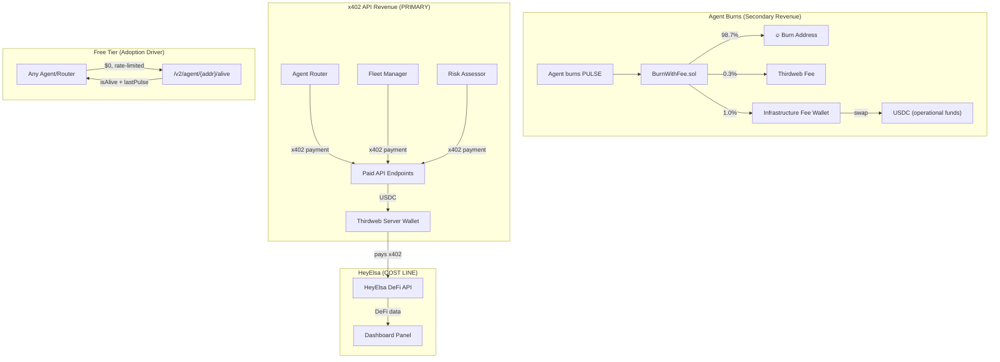

# Dual x402 Economy — Agent Pulse v4

## Overview

Agent Pulse participates in the x402 economy in **two distinct roles**:

1. **CONSUMER** — We pay HeyElsa for DeFi data (cost line)
2. **PRODUCER** — We provide derivative liveness intelligence (revenue line)

**x402 API revenue is the PRIMARY revenue stream.** Token burn fees are secondary.

---

## Token & Revenue Flow

---

## Revenue Streams (Ranked by Importance)

### 1. x402 API Revenue (PRIMARY)

We provide **derivative liveness intelligence** — signals computed from signal-sink data:

| What We Offer | Endpoint Fee | Who Uses It |
|-------------|-------|-------------|
| Reliability scores | $0.01 | Agent routers |
| Liveness proofs | $0.005 | Verification systems |
| Burn history | $0.015 | Analytics platforms |
| Streak analysis | $0.008 | Fleet managers |
| Peer correlation | $0.02 | Swarm coordinators |
| Uptime metrics | $0.01 | SLA monitors |
| Predictive insights | $0.025 | Risk assessors |
| Global network stats | $0.03 | Market researchers |

**Revenue scales with network size.** More agents pulsing → richer signals → more valuable API → more paying customers.

### 2. Token Burn Fees (SECONDARY)

The BurnWithFee wrapper captures 1% of every burn for infrastructure:

- 98.7% → burn address (deflationary)
- 0.3% → Thirdweb platform fee
- 1.0% → Infrastructure Fee Wallet

Fee wallet PULSE is periodically swapped to USDC. This covers operational costs but is NOT the primary business model.

### 3. DEX Trading Fees (TERTIARY)

- 80% → Treasury
- 20% → LP

---

## Cost Structure

### HeyElsa (x402 Consumer)

We **pay** HeyElsa for DeFi portfolio/balance data to power our dashboard panel:

| HeyElsa Endpoint | Cost per Call | Purpose |
|-----------------|---------------|---------|
| Portfolio data | ~$0.01 | Dashboard DeFi panel |
| Balance data | ~$0.005 | Dashboard DeFi panel |

**Key distinction:** We do NOT redistribute HeyElsa data. We consume it for our own dashboard. Our revenue comes entirely from providing our OWN derivative liveness intelligence.

### Infrastructure Costs

| Component | Cost/month | Notes |
|-----------|-----------|-------|
| Vercel (Edge + KV) | ~$20 | Free tier covers early stage |
| RPC (Alchemy/Base) | ~$0 | Free tier sufficient |
| Thirdweb | $0 | Free for x402 facilitator |

---

## Economics at Scale

| Agents | Queries/day | Revenue/day | Cost/day | Margin |
|--------|-------------|-------------|----------|--------|
| 50 | 250 | $2.50 | $10.25 | -$7.75 |
| 200 | 1,000 | $10 | $11 | ~breakeven |
| 500 | 2,500 | $25 | $12.50 | 50% |
| 5,000 | 25,000 | $250 | $35 | 86% |

**Breakeven:** ~100-200 agents pulsing with steady paid query volume.

---

## Why This Works

1. **Free tier creates lock-in** — Routers use `pulse-filter` for free → workers MUST pulse to stay visible
2. **Paid tier captures value** — Once routers depend on liveness checks, they upgrade to reliability scores, predictions, etc.
3. **Network effects compound** — More agents → richer correlation data → higher-value signals → justifies higher prices
4. **HeyElsa is a cost, not a dependency** — If HeyElsa disappears, only the dashboard panel is affected. Core protocol and revenue are unaffected.
