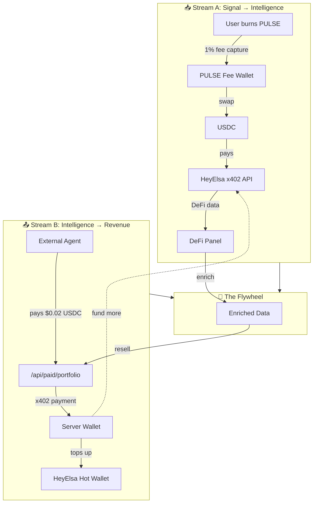

# Dual x402 Economy Flow

## Mermaid Diagram



## ASCII Version (for terminals)

```
┌─────────────────────────────────────────────────────────────────────────┐
│                         DUAL X402 ECONOMY                               │
└─────────────────────────────────────────────────────────────────────────┘

  STREAM A: Signal → Intelligence        STREAM B: Intelligence → Revenue
  ─────────────────────────────         ─────────────────────────────────

  User burns PULSE ──┐                   External Agent
                     │                        │
                     ▼                        ▼
           1% protocol fee           pays $0.02 USDC
                     │                        │
                     ▼                        ▼
            USDC Fee Wallet            /api/paid/portfolio
                     │                        │
                     ▼                        ▼
           swap to USDC ◄─────────── Server Wallet (revenue)
                     │                        │
                     ▼                        │
           HeyElsa Hot Wallet ◄───────────────┘
                     │
                     ▼
           HeyElsa x402 API
                     │
                     ▼
              DeFi Data
                     │
                     ▼
               DeFi Panel
                     │
                     ▼
            ┌─────────────┐
            │  ENRICHED   │──────────┐
            │   DATA      │          │
            └─────────────┘          │
                                     │
                                     ▼
                           sold via x402 to
                           other agents
                                     │
                                     ▼
                            ┌─────────────────┐
                            │   THE FLYWHEEL  │
                            │                 │
                            │  More revenue   │
                            │  → More data    │
                            │  → Better AI    │
                            │  → More agents  │
                            │  → More revenue │
                            └─────────────────┘
```

## Key Flow Explanation

1. **Stream A (Buyer):**
   - User sends PULSE signal
   - 1% fee captured by protocol
   - Fee swapped to USDC
   - USDC pays HeyElsa x402 API for DeFi data
   - Data enriches Agent Pulse's intelligence

2. **Stream B (Seller):**
   - External agents call `/api/paid/portfolio`
   - Pay $0.02 USDC via x402
   - Revenue goes to server wallet
   - Server wallet tops up HeyElsa hot wallet
   - Funds more intelligence purchases

3. **The Flywheel:**
   - Both streams fund continuous intelligence acquisition
   - Enriched data attracts more external agents
   - More API sales = more revenue
   - Self-sustaining without subsidies

## Payment Specifications

| Stream | Endpoint | Cost | Token | Network |
|--------|----------|------|-------|---------|
| A (Buy) | HeyElsa `/api/get_portfolio` | ~$0.01 | USDC | Base |
| A (Buy) | HeyElsa `/api/get_balances` | ~$0.005 | USDC | Base |
| B (Sell) | `/api/paid/portfolio` | $0.02 | USDC | Base |

## Net Margin Calculation

- **Cost per enriched call:** ~$0.01 (HeyEsla data)
- **Revenue per API call:** $0.02 (external agent payment)
- **Gross margin:** ~50%
- **Cache efficiency:** 60s TTL reduces HeyElsa calls by ~40%
- **Effective margin:** ~70% after caching
