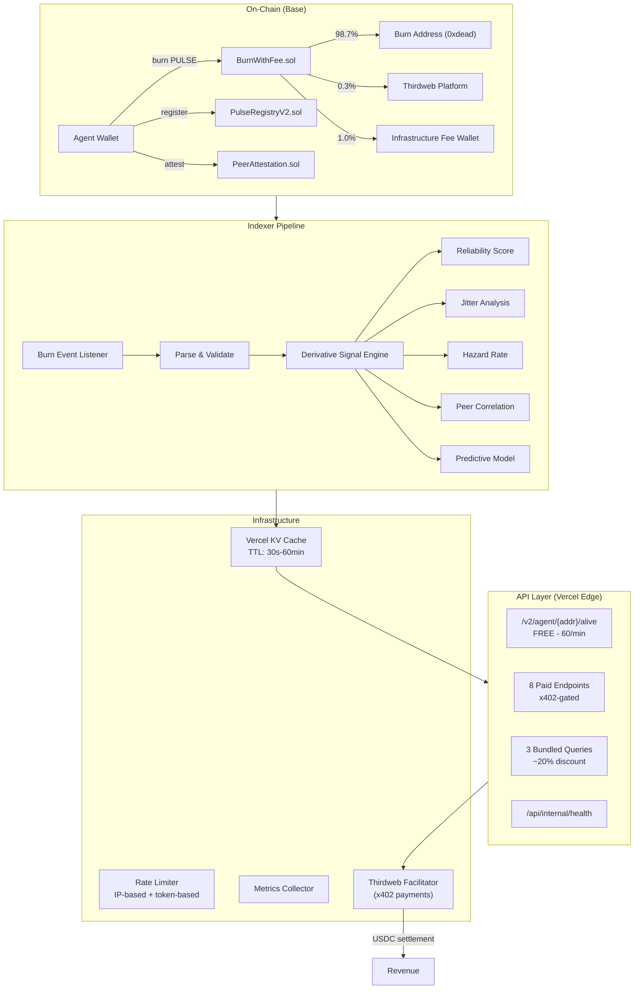
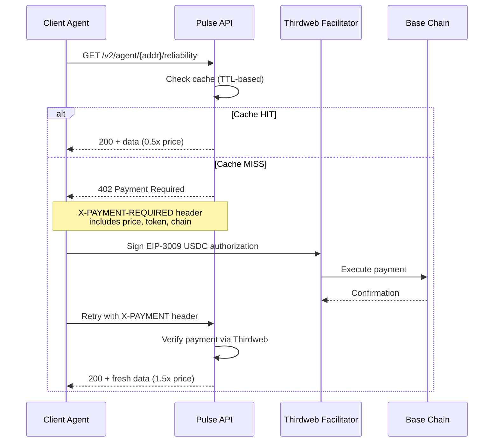

# Agent Pulse — Technical Brief (v4)

**Version:** 4.0  
**Date:** 2026-02-06  
**Purpose:** System architecture and implementation details for the Agent Pulse liveness intelligence protocol

---

## Executive Summary

Agent Pulse is a liveness and reliability protocol for AI agents. Agents burn PULSE tokens daily via the BurnWithFee wrapper contract. An indexer pipeline detects burn events, computes derivative signals (reliability scores, jitter analysis, hazard rates, peer correlation), and serves them via x402-gated API endpoints. The free tier (`isAlive`) drives adoption; the paid tier generates revenue.

---

## 1. System Architecture



---

## 2. Indexer Pipeline

### Burn Event Detection

The indexer monitors `Transfer` events to the burn address from the BurnWithFee wrapper:

```
BurnWithFee.burn(amount)
  → 98.7% Transfer(from, 0xdead, burnAmount)
  → 1.0% Transfer(from, feeWallet, feeAmount)
  → 0.3% Thirdweb platform fee
  → Emit PulseBurned(agent, amount, timestamp)
```

### Derivative Signal Computation

| Signal | Inputs | Output | Update Frequency |
|--------|--------|--------|-----------------|
| **Reliability Score** | Burn history, streak, timing variance | 0-100 score | Every burn event |
| **Jitter Analysis** | Time deltas between consecutive burns | Variance coefficient | Every burn event |
| **Hazard Rate** | Time since last burn, historical pattern | 0-1 probability | Continuous (decaying) |
| **Peer Correlation** | Multi-agent burn timing patterns | Correlation matrix | Hourly batch |
| **Predictive Insights** | All above + network context | Risk classification | On-demand |
| **Uptime Metrics** | MTTR, MTBF, downtime events | SLA-style metrics | Every burn event |
| **Streak Analysis** | Consecutive on-time burns | Current/max/consistency | Every burn event |

---

## 3. x402 Payment Flow



### Freshness Pricing (implemented in `x402-gate.ts`)

```typescript
// From pricing.ts — all prices in USDC atomic units (6 decimals)
function getPrice(endpoint: string, cacheHit: boolean): bigint {
  const base = BASE_PRICES[endpoint];
  return cacheHit ? base / 2n : (base * 3n) / 2n;
}
```

| Freshness | Multiplier | Trigger |
|-----------|------------|---------|
| Real-time | 1.5x | Cache miss, fresh computation |
| Cached | 0.5x | Cache hit within TTL |

---

## 4. Caching Strategy

Implemented in `lib/cache.ts` using Vercel KV.

| Endpoint | Cache TTL | Rationale |
|----------|-----------|-----------|
| `/alive` (free) | 60s | High-frequency, low-cost |
| `/reliability` | 5min | Moderate freshness need |
| `/liveness-proof` | 30s | Near real-time requirement |
| `/burn-history` | 15min | Historical, slow-changing |
| `/streak-analysis` | 5min | Updates on burn events |
| `/peer-correlation` | 60min | Expensive batch computation |
| `/uptime-metrics` | 5min | Moderate freshness need |
| `/predictive-insights` | 60min | ML inference cost |
| `/global-stats` | 60min | Network-wide aggregate |

### Cache Key Structure

```
pulse:v2:{endpoint}:{address}:{freshness}
pulse:v2:reliability:0x1234...:fresh
pulse:v2:global-stats::cached
```

---

## 5. Rate Limiting

Implemented in `lib/rate-limit.ts`.

| Tier | Limit | Scope | Endpoints |
|------|-------|-------|-----------|
| **Free** | 60/min, 1000/day | Per IP | `/alive` only |
| **Paid** | Unlimited | Per payment | All x402 endpoints |
| **Internal** | No limit | Server-only | `/api/internal/health` |

### Headers

```http
X-RateLimit-Limit: 60
X-RateLimit-Remaining: 45
X-RateLimit-Reset: 1707168000
```

---

## 6. Security Model

### On-Chain
- **BurnWithFee** — Wrapper ensures correct fee split; no admin can change burn percentage
- **PulseRegistryV2** — `Ownable2Step` + `Pausable` + `ReentrancyGuard`; 65 tests including exploit/DoS scenarios
- **PeerAttestation** — Agents attest to peers; Sybil-resistant via burn requirement

### API Layer
- x402 payment verification via Thirdweb facilitator (no custom payment handling)
- Rate limiting per IP (free tier) prevents abuse
- No wallet popups — server-side payment validation only
- All paid endpoints require valid cryptographic payment proof

### Infrastructure
- Vercel Edge Functions — no persistent state, no server to compromise
- Vercel KV — encrypted at rest, access via environment tokens only
- Environment secrets managed via Vercel dashboard (never in code)

### Audit History
- 2 pentest rounds, 4 red team agents, 26 findings remediated
- Full reports in [`REPORTS/`](../REPORTS)

---

## 7. Smart Contracts

### BurnWithFee.sol
- Wraps PULSE token burn with fee split
- 98.7% → burn address, 0.3% → Thirdweb, 1.0% → infrastructure wallet
- 33 tests passing
- Immutable fee percentages

### PulseRegistryV2.sol
- On-chain liveness registry
- `pulse(amount)` → burn via BurnWithFee, update streak + timestamp
- `isAlive(address)` → true if last pulse within TTL (default 24h)
- `getAgentStatus(address)` → full status struct
- 65 tests passing (core + exploit + DoS + owner abuse)

### PeerAttestation.sol
- Agents attest to peer reliability
- Feeds peer correlation signal
- Requires active pulse status to attest

---

## 8. Tech Stack

| Component | Technology |
|-----------|-----------|
| Frontend | Next.js 16, React, Tailwind |
| API | Vercel Edge Functions |
| Cache | Vercel KV |
| Payments | x402 protocol, Thirdweb facilitator |
| Chain | Base (Sepolia for testnet, mainnet for production) |
| Contracts | Solidity 0.8.20, Foundry |
| Client SDK | viem, wagmi, RainbowKit |
| Indexing | thirdweb Insight |
| Monitoring | `lib/metrics.ts` |

---

## Appendix: Environment Variables

See `apps/web/.env.example` for the canonical list. Key variables:

| Variable | Purpose |
|----------|---------|
| `THIRDWEB_SECRET_KEY` | x402 facilitator authentication |
| `THIRDWEB_SERVER_WALLET_ADDRESS` | Payment receiving wallet |
| `BASE_RPC_URL` | Base chain RPC endpoint |
| `KV_REST_API_URL` / `KV_REST_API_TOKEN` | Vercel KV connection |
| `HEYELSA_API_URL` | HeyElsa DeFi data (cost line) |

Contract addresses: See [LINKS.md](../LINKS.md)
